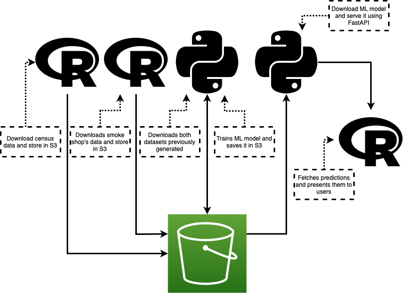

# R Ecosystem 4 Pythonistas

## Data Pipeline

S3 bucket: `s3://census-smoke-shops-pipeline`

### 01_get_census_data

- Inputs: None
- Outputs: 
  - `census-data/new_york_zip_code_data.csv`

Downloads data for New York state from the 2010 census and saves the cleaned version to an S3 bucket for further processing.

### 02_get_smoke_shop_data

- Inputs: None
- Outputs: 
  - `smoke-shops-data/new_york_smoke_shops_data.csv`

Downloads data from the NY Health data portal about the smoke shops throughout the state and writes it to an S3 bucket for further processing.

### 03_train_ml_model

- Inputs:
  - `smoke-shops-data/new_york_smoke_shops_data.csv`
  - `census-data/new_york_zip_code_data.csv`
- Outputs:
  - `ml-models/linear_regression.joblib`

Downloads both data files previously generated and trains a Linear Regression with median age and average household size as predictor variables of the number of smoke shops per zip code. It then saves the model as `*.joblib` file for further use.

### 04_serve_ml_model

- Inputs:
  - `ml-models/linear_regression.joblib`
- Outputs:
  - API endpoint (`/predict`)
  
Defines a FastAPI endpoint to serve predictions of the regression model to the Shiny app

### 05_consume_predictions

- Inputs:
  - API endpoint (`/predict`)
- Outputs:
  - Predictions
  
User Interface to explore predictions

## Ideas to expand the pipeline

- Replace all R config values with the `{config}` package
- Normalize the number of smoke shops and store this as metadata to be used later post-prediction
- Add renv and virtualenvs for the different components of the pipeline
- Add versioning to cloud bucket to save different model versions automatically
- Add logging to the training process
- Dockerize the FastAPI API
- Extend the Shiny application to show more information (like census data)
